# Wedding RSVP Website

<div align="center">
  
  
  <br>
  
</div>

## Introduction

We (Elaheh and Parham) are going to get married.
This repository will provide the invitation card and details of the ceremony.

> [!note]
> This project is also designed as a **template** for anyone who wants to create their own wedding RSVP website. Fork it and customize it for your own wedding!

## Screenshots

The site has an English landing page and Persian invitation pages, plus a per-guest RSVP page
generated from a private link.

|                        Home (English)                         |                    Wedding (Persian)                    |
| :-----------------------------------------------------------: | :-----------------------------------------------------: |
|  |  |

Both ceremony pages carry the invitation text, the venue address, and Google Maps / Neshan links:

|                       Wedding invitation                        |                     Engagement invitation                     |
| :-------------------------------------------------------------: | :-----------------------------------------------------------: |
| 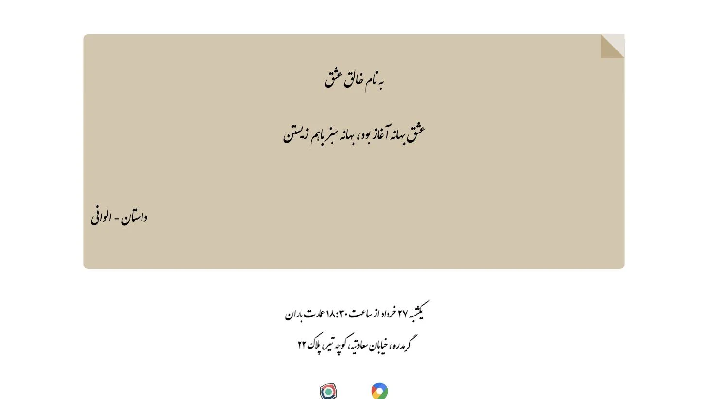 | 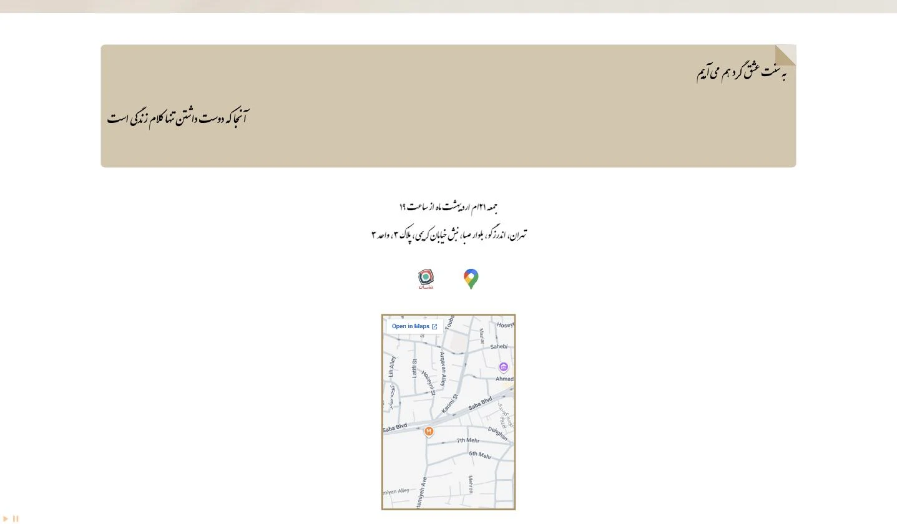 |

Each guest gets a personalised page at `/guests/<id>`. Non-family guests see an
RSVP form, and can change their answer for as long as the RSVP is open:

|                          RSVP form                          |                       After responding                        |
| :---------------------------------------------------------: | :-----------------------------------------------------------: |
| 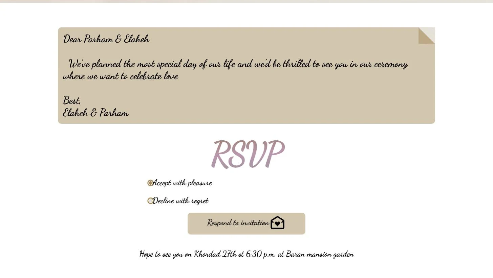 | 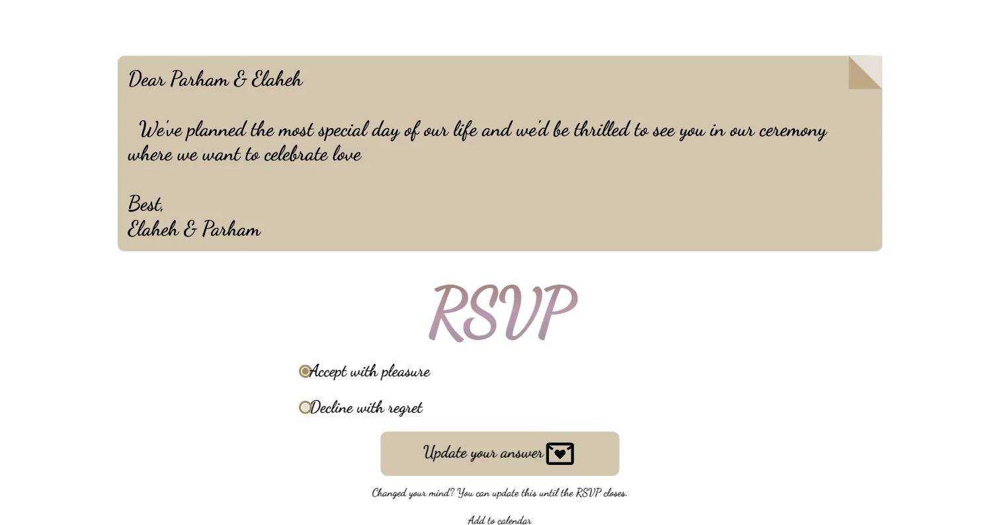 |

The form also collects anything the kitchen should know and a song request:

<div align="center">
  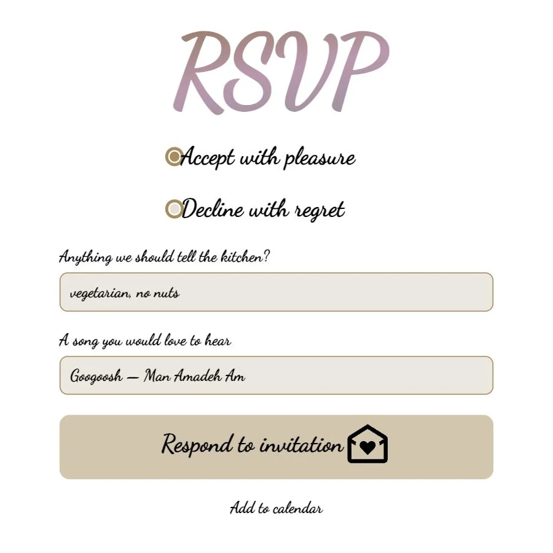
</div>

Once `wedding.rsvp_deadline` passes, the form is replaced by a closed notice and
the backend refuses further answers:

<div align="center">
  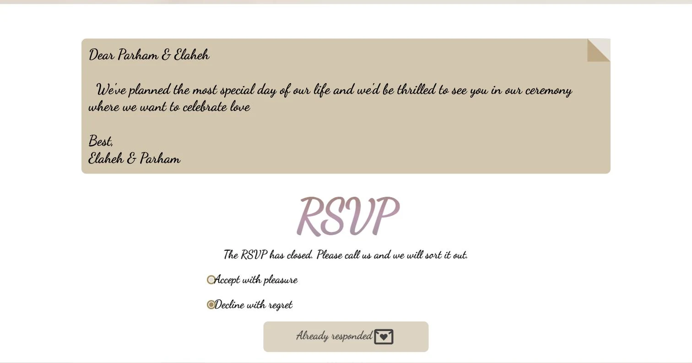
</div>

Every page closes with the couple's links:

<div align="center">
  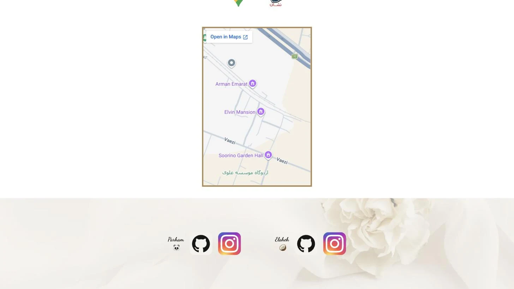
</div>

Guests are managed from the terminal — two Bubble Tea TUIs for browsing and
adding people one at a time, and a CSV importer for a whole list at once:

<div align="center">
  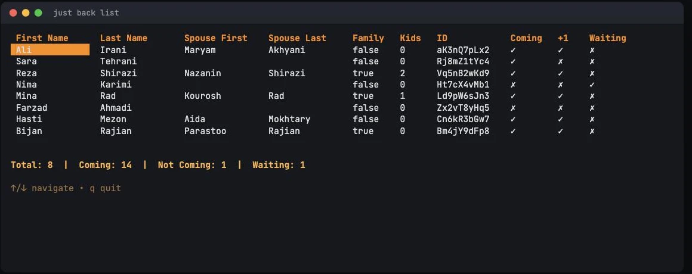
  <br><br>
  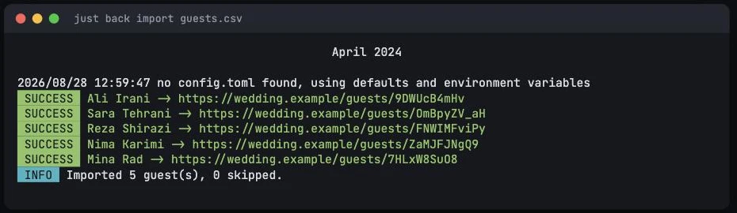
  <br><br>
  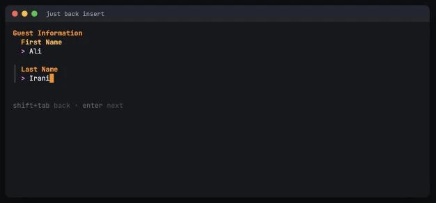
</div>

`just back notes` collects what guests wrote, ready to hand to the caterer and
the DJ:

<div align="center">
  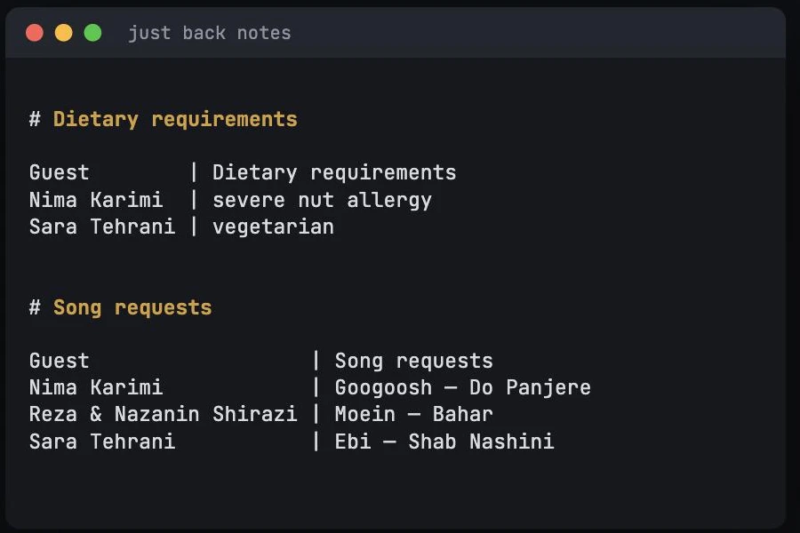
</div>

`just back remind` renders a ready-to-send message for everyone who has not
replied yet, and `just back qr` writes a QR code per guest that points at their
own page — for the printed cards:

<div align="center">
  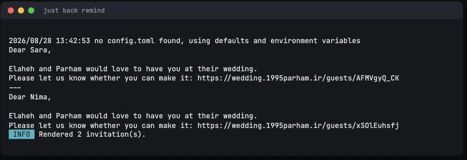
  <br><br>
  
</div>

## How does it happen?

The following are the tasks and things we are doing for our wedding.

- Mina Rad - 1
- Mina Rad - 2
- Hasti Mezon
- Shemiranat health and treatment network
- Farzad Ahmadi
- Rozzet Studio
- Noghreh Wedding
- Rajian
- Boho Floral Design Studio - 1
- Boho Floral Design Studio - 2
- Kourosh Ceremonial Services
- Aida Mokhtary
- Ajoodaniyeh Mansion
- Makan Mansion
- Parastoo Mezon
- Saadat Rent - 1
- Saadat Rent - 2

## Running the Project

This project uses [just](https://github.com/casey/just) as a command runner. Install it first, then:

```bash
# Install all dependencies
just install

# Start both frontend and backend for development
just dev

# Build everything for production
just build

# Run all tests
just test
```

### Backend (WedBack)

The backend is a Go application that manages guests and serves the API on `:1378`.

```bash
just back serve                  # Build and start the server
just back insert                 # Add a new guest (interactive TUI)
just back list                   # List all guests with RSVP status
just back waiting                # List only the guests who have not replied
just back import guests.csv      # Bulk import guests from CSV
just back import-check guests.csv# Parse the CSV and report, without writing
just back export rsvps.csv       # Export every guest and their RSVP
just back invite                 # Render each guest's message and link
just back remind                 # Same, but only for guests still waiting
just back qr ./qr                # A QR code per guest, for printed cards
just back reset <guest-id>       # Clear one guest's RSVP so they can redo it
just back notes                  # Dietary requirements and song requests
just back test                   # Run tests
just back lint                   # Run linter
```

Configuration lives in `wedback/config.toml`. Every key can also be set through
the environment with a `wedback_` prefix, using `__` to descend into a section
(`wedback_wedding__husband_name`, `wedback_database__dsn`). Precedence is
defaults < `config.toml` < environment. Running without a `config.toml` is fine;
a malformed one stops the process rather than being silently ignored.

#### Adding a new guest

`just back insert` opens an interactive TUI where you fill in:

1. First Name
2. Last Name
3. Partner's First Name
4. Partner's Last Name
5. Is Family? (`true` / `false`)
6. Children (number)

Use `Tab` / `Shift+Tab` to navigate between fields and `Enter` to confirm.

#### Importing a guest list

For anything larger than a handful of guests, put them in a CSV instead:

```csv
first_name,last_name,spouse_first_name,spouse_last_name,is_family,children
Ali,Irani,Maryam,Akhyani,false,0
Sara,Tehrani,,,false,0
Reza,Shirazi,Nazanin,Shirazi,true,2
```

Only `first_name` and `last_name` are required. Columns are matched by header
name, so their order does not matter and extra columns are ignored. Run
`just back import-check guests.csv` first to see what would be created, then
`just back import guests.csv` to write it — each guest is reported with their
personal invitation link. Duplicate names are skipped with a warning rather
than aborting the run.

`just back export rsvps.csv` writes the whole list back out with each guest's
answer and link, which is the easiest way to read RSVPs in a spreadsheet. The
export can be fed straight back into `import`.

#### Sending the invitations

Every guest has their own RSVP link, and copying a hundred of them by hand is
the most tedious part of running the site. `just back invite` renders a ready
message per guest:

```
Dear Ali & Maryam,

Elaheh and Parham would love to have you at their wedding.
Please let us know whether you can make it: https://…/guests/aK3nQ7pLx2
```

Set `wedding.invite_template` in `config.toml` to change the wording. It is a
Go [text/template](https://pkg.go.dev/text/template) over `.Names`,
`.FirstName`, `.LastName`, `.SpouseFirstName`, `.SpouseLastName`, `.Link`,
`.ID`, `.IsFamily`, `.Children`, `.Husband`, `.Wife`, `.Answered` and
`.Coming` — so it works just as well in Persian.

Messages go to stdout, so they pipe: `just back invite > invites.txt`.

- `just back remind` renders only the guests who have not replied. Family
  guests count as attending without replying, so they are never chased.
- `just back qr ./qr` writes a `<guest-id>.png` QR code per guest, pointing at
  that guest's page — handy on a printed card, where nobody wants to type a URL.
- `just back invite <guest-id>` does a single guest.

#### Dietary requirements and song requests

The RSVP carries two optional free-text fields — one for the kitchen and one
for the playlist. Guests marked as family never see the coming-or-not question,
but they still get these two, because the caterer and the DJ need them just the
same.

`just back notes` prints both lists, ready to hand over:

```
# Dietary requirements
Guest        | Dietary requirements
Nima Karimi  | severe nut allergy
Sara Tehrani | vegetarian

# Song requests
Guest                  | Song requests
Nima Karimi            | Googoosh — Do Panjere
Reza & Nazanin Shirazi | Moein — Bahar
```

`--only dietary` or `--only songs` narrows it, and both fields are columns in
`just back export`. Either can be switched off in `guestLetter.extras` in
`wedfront/src/wedding.config.ts`; answers are capped at 280 characters.

#### When someone changes their mind

Guests can update their answer in place for as long as the RSVP is open; the
reply is overwritten rather than added, so there is only ever one answer per
guest. To put someone back in the waiting list, `just back reset <guest-id>`.

Set `wedding.rsvp_deadline` to an RFC 3339 timestamp to close the RSVP. After
it passes the backend refuses new answers with `403` and the invitation page
shows a closed notice instead of the form. Leave it empty to never close.

### Frontend (WedFront)

<div align="center">

[](https://astro.build)

</div>

The frontend runs as a standalone Astro Node.js server (SSR). It proxies API requests to the backend internally.

```bash
just front install    # Install pnpm dependencies
just front dev        # Start dev server at localhost:4321
just front build      # Build for production
just front serve      # Start production server
just front format     # Format code with Prettier
just front clean      # Remove node_modules and build output
```

Set `WEDFRONT_BACKEND_URL` to point to the backend (defaults to `http://127.0.0.1:1378`).

`/wedding.ics` serves the ceremony as a calendar file, linked from every guest
page as "Add to calendar".

## Customization

To use this project for your own wedding, fork the repository and edit the
following. Everything guest-facing lives in one file per side.

### Frontend

`wedfront/src/wedding.config.ts` holds every guest-facing string, date, link and
asset name — names, dates, socials, music, the invitation poetry, the RSVP
labels, and both venues:

```typescript
export const wedding = {
  couple: {
    husband: { name: "...", nameLocal: "...", lastName: "...", emoji: "...", socials: { ... } },
    wife:    { name: "...", nameLocal: "...", lastName: "...", emoji: "...", socials: { ... } },
    lastNameLocal: "...",
  },
  dates: {
    wedding: "Jun 16, 2024 18:30:00+03:30",
    engaged: "May 10, 2024 19:00:00+03:00",
    rsvpDeadline: "",           // what the page says; the backend enforces it
  },
  calendar: { durationHours: 5 },   // for the /wedding.ics link
  site: { url: "...", github: "..." },
  music: { ceremony: "...", engaged: "..." },

  // Locale of the two ceremony pages. Drives lang/dir, the invitation font,
  // and the countdown numerals.
  ceremony: { lang: "fa", dir: "rtl" },

  invitations: {
    wedding:     { lines: ["...", "..."], signature: "..." },
    engagement:  { lines: ["...", "..."], signature: "" },
  },
  guestLetter: {
    body: "...", signOff: "Best,",
    rsvp: { heading: "RSVP", accept: "...", decline: "...", plusOne: "...", submit: "...", submitted: "..." },
  },
  venues: {
    wedding: {
      name: "...",
      when: "...",          // in the ceremony locale
      address: "...",
      whenEnglish: "...",   // shown on the English guest pages
      maps: { google: "...", neshan: "...", embed: "..." },
    },
    engagement: { ... },
  },
};
```

Then replace `wedfront/src/assets/wedding.jpg` with your own photo and drop your
two tracks into `wedfront/public/`.

The landing page and the per-guest pages are always English. The two ceremony
pages (`/wedding` and `/engaged`) render in `ceremony.lang`; set `neshan` to an
empty string to drop the Iranian maps link.

> [!note]
> The ceremony pages assume a right-to-left, non-Latin locale — the bundled font
> is Persian and the "days since" string in `splash.astro` is Persian. Changing
> the ceremony language means swapping the font in `styles/ceremony.css` and
> that one string.

### Backend

Edit `wedback/config.toml`:

```toml
[wedding]
husband_name = "Your Name"
wife_name = "Partner Name"
base_url = "https://your-wedding-site.com"
```

Or set the matching `wedback_wedding__*` environment variables. `base_url` is
what the guest links printed by `import`, `list`, `invite` and `export` are
built from.

Two more keys live in the same section:

```toml
# Closes the RSVP. Empty means it never closes.
rsvp_deadline = "2024-06-01T23:59:59+03:30"

# The message `wedback invite` renders per guest; empty uses the built-in one.
invite_template = """"""
```

`rsvp_deadline` is the one that actually enforces the cutoff —
`dates.rsvpDeadline` in the frontend only decides what the page says, so keep
the two in step.
